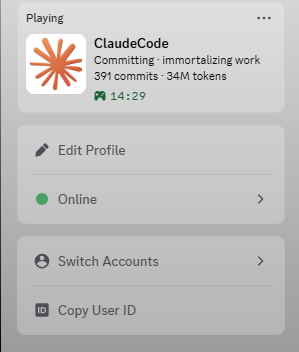

# claude-presence


My first open-source project. It puts a silly coding vibe, your total
commits, and your Claude Code token usage on your Discord profile.



Everything runs locally. Nothing gets sent anywhere except your own Discord
app (same way games announce "Playing X").

## Setup

You need Python 3.9+ and the Discord desktop app open.

### 1. Clone and install

```
git clone https://github.com/TheRealSwisa/Claude-Presence
cd Claude-Presence
pip install -r requirements.txt
cp .env.example .env
```

### 2. Make a Discord app

1. Go to https://discord.com/developers/applications and click **New
   Application**. Name it whatever you want shown on your profile (no
   spaces — something like `ClaudeCode` or your initials).
2. Copy the **Application ID** into `.env` as `DISCORD_CLIENT_ID`.
3. Click **Rich Presence → Art Assets → Add Image(s)**. Upload any square
   PNG, name its key `logo`. That shows up as the big icon next to your
   profile text.
4. Set an **App Icon** on the General Information tab if you want one.

This repo has no images. Use your own.

### 3. Run it

```
python vibe.py
```

Give it 15 seconds, then check your Discord profile. You should see a
"Playing <your app name>" block with the vibe, your commits, your tokens,
and an elapsed timer.

Ctrl-C to stop.

## Running it

### Start / stop

```
run.bat      start the daemon
stop.bat     kill the daemon
```

On macOS / Linux just do `python vibe.py` to start, Ctrl-C to stop.

### Run at login (Windows)

First make it silent (no black console window on startup):

```
copy C:\path\to\Python\pythonw.exe .\claude-presence.exe
```

Then run this once:

```
install-autostart.bat
```

That drops a shortcut into your Startup folder. Next time you log in,
the daemon launches on its own. To undo, delete
`shell:startup\claude-presence.lnk` (Win+R → `shell:startup`).

### Run at login (macOS / Linux)

Stick this in your shell rc or a systemd unit:

```
python /path/to/Claude-Presence/vibe.py &
```

## What it reads from your machine

Being upfront about this since it scans your files:

- **Claude transcripts** (`~/.claude/projects/**/*.jsonl`) — reads the
  `usage` field to sum input + output tokens and count messages. Never
  reads the actual text of your conversations.
- **`.git` folders under your home dir** — runs `git rev-list --count HEAD`
  in each to sum your total commits. No diffs, no code, just the count.
- **Discord local IPC** — sends the vibe string, commit count, token count,
  and your image key. Nothing else.

The repo scanner is capped: depth 6, 200 repos max, 10-second timeout, no
symlinks, skips `node_modules`, `.venv`, `AppData`, `Windows`, etc.

If you don't want your whole home folder scanned, set `REPO_ROOT` in `.env`
to something specific, or list individual repos with `REPO_PATHS`.

## Config

Everything in `.env`:

| Var | Default | What it does |
|---|---|---|
| `DISCORD_CLIENT_ID` | — | required, from the Discord dev portal |
| `REPO_ROOT` | `~` | folder to scan for git repos |
| `REPO_PATHS` | — | comma-separated list of specific repos (overrides `REPO_ROOT`) |
| `LARGE_IMAGE_KEY` | `logo` | asset key for the big icon |
| `UPDATE_INTERVAL` | `15` | seconds between updates (15 is Discord's minimum) |
| `IDLE_SECONDS` | `300` | hide presence if you haven't touched Claude in this long |
| `VIBE_ROTATION` | `120` | base seconds per vibe (actual hold is randomized 0.5x-2x) |

## Adding your own vibes

Open `vibes.py`. There are five lists: `WORKING`, `DEBUGGING`, `TESTING`,
`BUILDING`, `COMMITTING`. Throw any string into whichever one fits. Keep
them short so Discord doesn't truncate.

## Files

```
vibe.py                 the main loop
vibes.py                all the flavor strings
stats.py                commit counter + transcript parser
state.py                history log
run.bat                 Windows launcher
stop.bat                kills the daemon
install-autostart.bat   registers run.bat in your Windows Startup folder
data/                   local history + error log (gitignored)
```

## FAQ

**Does this send anything to Anthropic or Discord or anywhere?**
No. `stats.py` only reads local files. `vibe.py` only talks to your local
Discord desktop client over IPC. Same channel League or any other game
uses to say "Playing X".

**Why are my tokens different from Anthropic's dashboard?**
This sums `input_tokens + output_tokens` from every `.jsonl` on disk. The
dashboard's "Total tokens" excludes cache reads too, so the numbers line
up roughly. If you delete a transcript, those tokens stop counting here.

**How does it know when I'm debugging vs testing vs building?**
It doesn't. The pools just rotate randomly. I'd rather not scan your
running processes or your code to guess. The vibes are flavor, not facts.

**The presence disappeared. How do I bring it back?**
- Fully quit Discord desktop (system tray, not just the X button).
- Re-run `python vibe.py` or restart `run.bat`.
- Check `data/error.log` for the last crash.

**Can I ship a fork with the Claude logo?**
For personal use on your own profile, do what you want. Don't publish a
fork with logos or names you don't own.

## License

MIT. See `LICENSE`.
